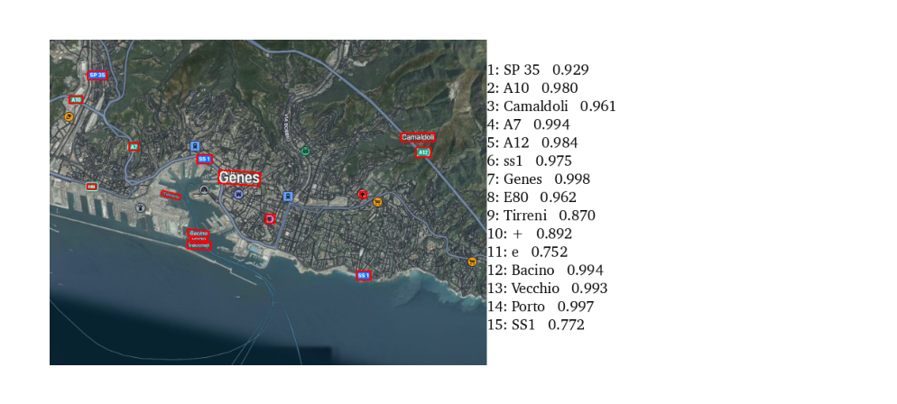

# OCR Project

This project uses PaddleOCR to extract text from an image and outputs the results in JSON format.

## Setup

1. **Clone the repository**:
    ```bash
    git clone https://github.com/azizlahiani1639/ocr_maps.git
    cd ocr_maps
    ```

2. **Create a virtual environment and activate it**:
    ```bash
    python -m venv venv
    venv\Scripts\activate  # On Windows
    ```

3. **Install the dependencies**:
    ```bash
    pip install -r requirements.txt
    ```

## Usage

1. **Place your `Genova.png` image in the project directory**.
2. **Run the OCR script**:
    ```bash
    python ocr_script.py
    ```

The output will be saved to `ocr_output.json`.

## Results

Here is an example of the OCR output visualization:



## Dependencies

- paddlepaddle
- paddleocr
- opencv-python-headless
- matplotlib
- setuptools

